# Лабораторная работа 1

## Ход работы

### Шаг 1. Создание файлов с конфигурациями

Создаем файлы `docker-compose.yml` и файл `promtail_config.yml` с конфигом для сервиса `promtail`.

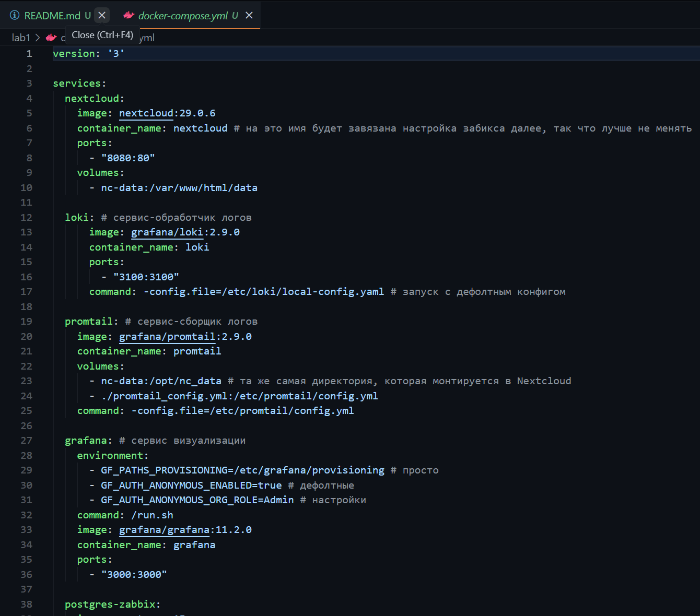
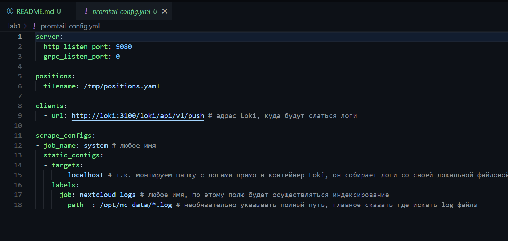

### Шаг 2. Запускаем `docker-compose` и поднимаем сервисы

Используем для этого команду: `docker compose up -d`
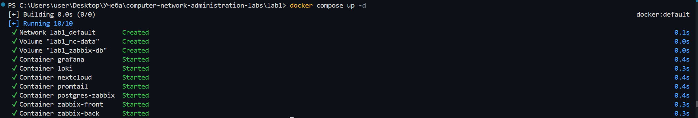

### Шаг 3. Инициализация Nextcloud

Добавляем юзера в веб-интерфейсе
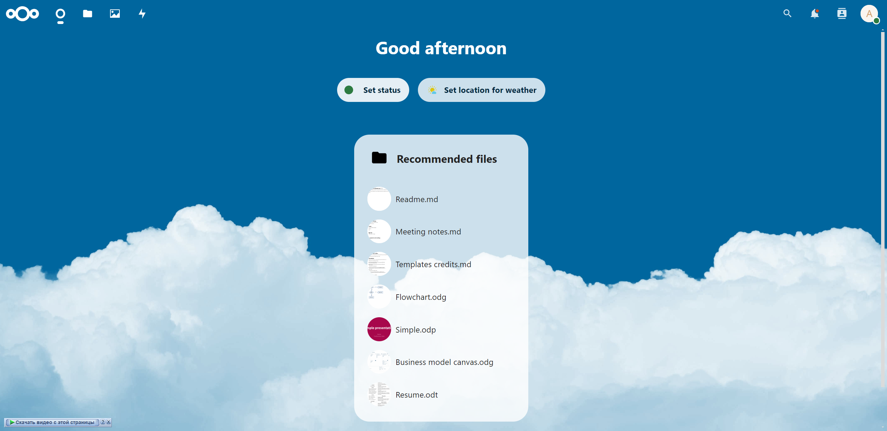

И смотрим появились ли логи в файле `/var/www/html/data/nextcloud.log`
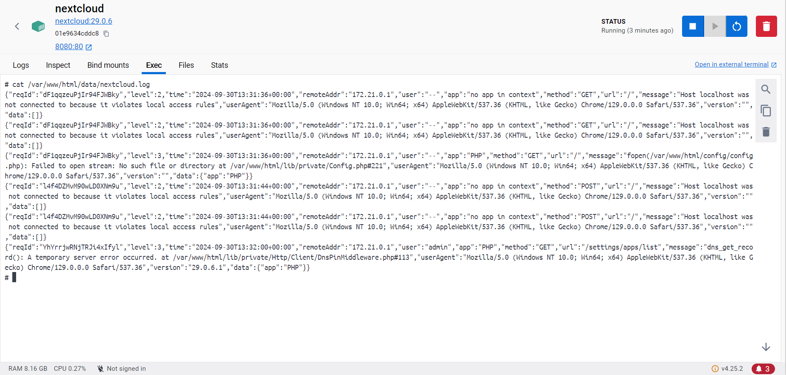

### Шаг 4. Проверка promtail

Проверяем подцепил ли `promtail` лог файл из предыдущего пункта
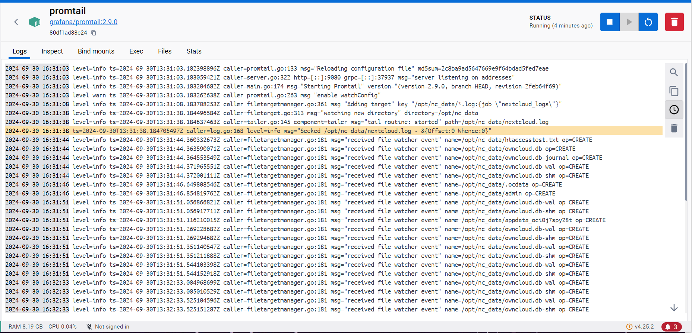

### Шаг 5. Настройка Zabbix

1. Подключаем темплейт для мониторинга Nextcloud

2. Разрешаем обращение по домену `nextcloud` в контейнере Nextcloud'а при помощи команды: `php occ config:system:set trusted_domains 1 --value="nextcloud"`

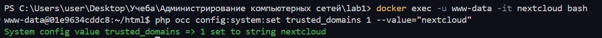

3. Создаем Host с добавленным шаблоном для пинга сервиса Nextcloud

4. Видим, что в разделе "Monitoring" появился статус `healthy/unhealthy` для сервиса Nextcloud

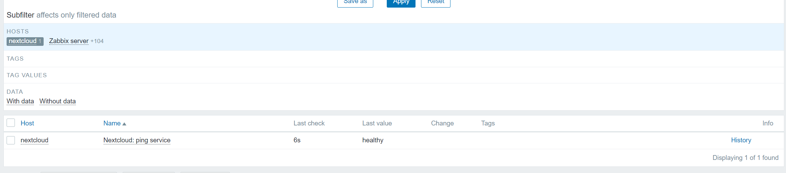

### Шаг 6. Настройка Grafana
1. Устанавливаем плагин Zabbix
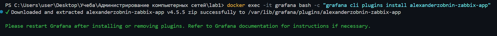

2. Разрешаем плагин Zabbix

3. Добавляем Data source - Loki
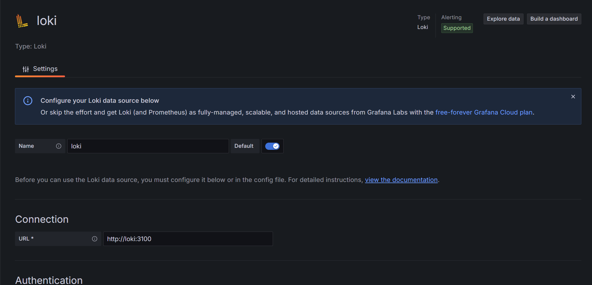

4. Добавляем Data source - Zabbix
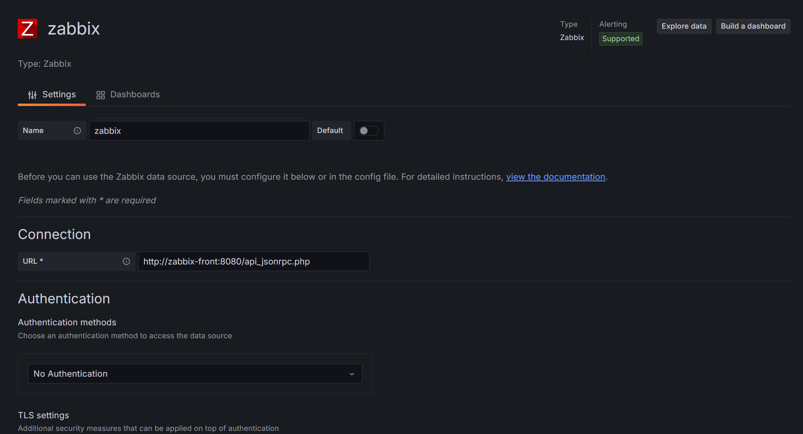
   
5. Создаем дашборд, состоящий из списка логов и таблички, меняющей цвет в зависимости от того, 'здоров' ли сервис Nextcloud

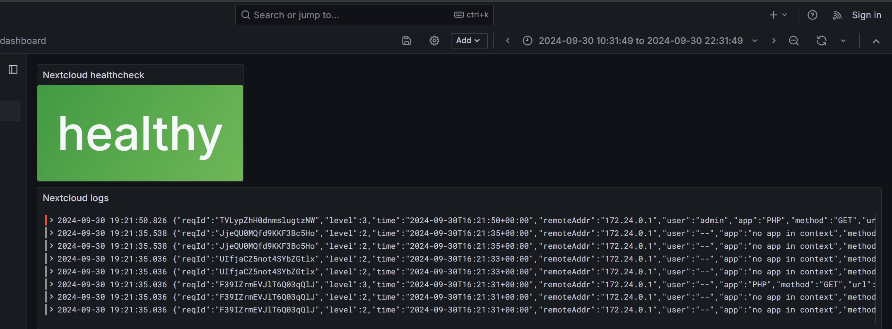
