# Лабораторная работа 2

## Ход работы

### Работа по гайду

#### Часть 1

1. Создаем директорию для работы  
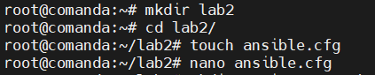

2. Проверяем что сервер с Ansible подключился к “клиенту”  
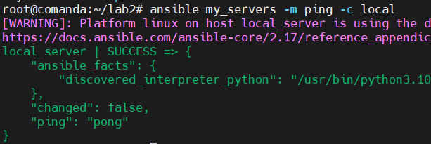

3. Попробуем создать файл через модуль shell Ansible.  
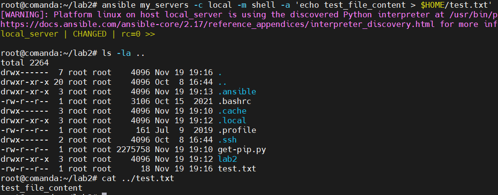
#### Часть 2
1. Инициализируем исходное конфигурационное “дерево”  
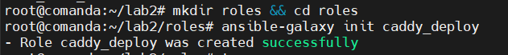
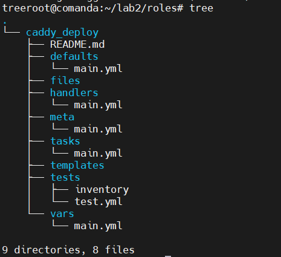
2. Создадим файл конфигурации плейбука  
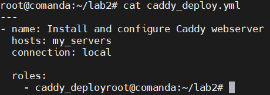  
3. Заполним файл `roles/caddy_deploy/tasks/main.yml`
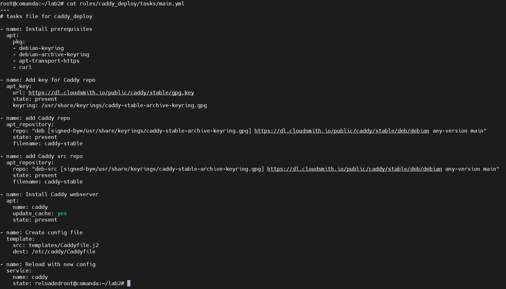  
4. Проверим работает ли плейбук
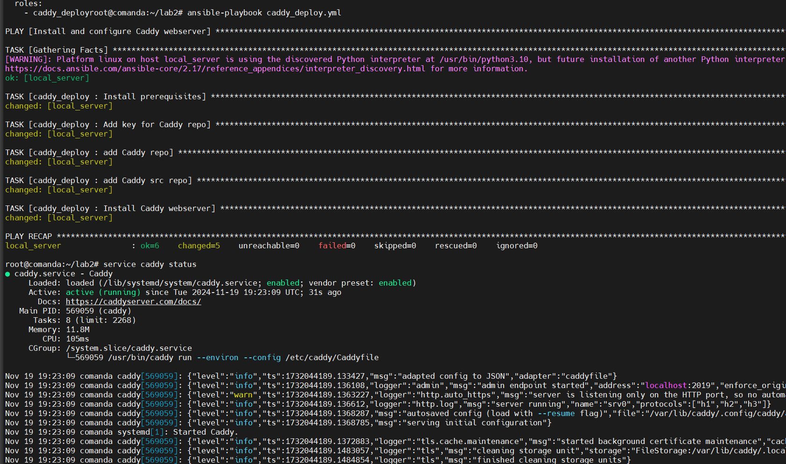  
#### Часть 3
1. Купили домен и привязали к IP-адресу сервера  
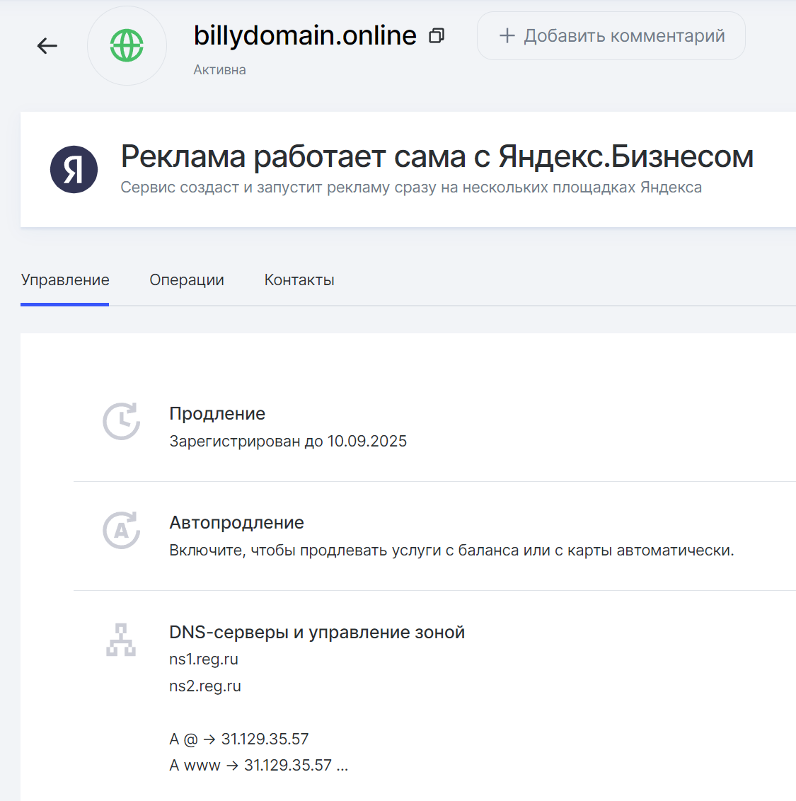
2. Создадим файлы `Caddyfile.j2` и `vars/main.yml`  
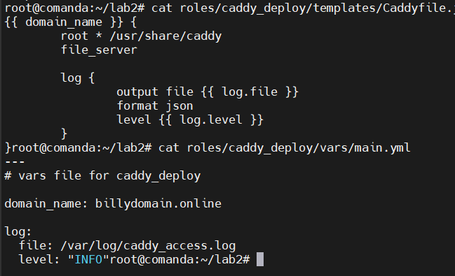
3. Проверим работу плейбука  
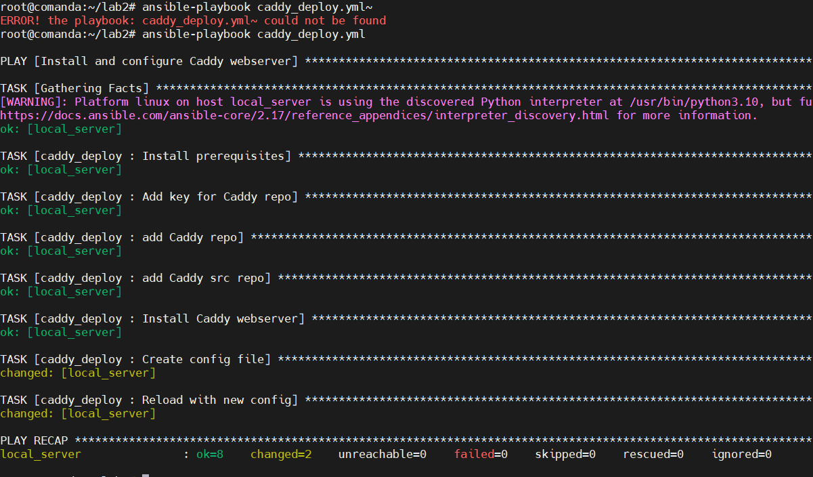
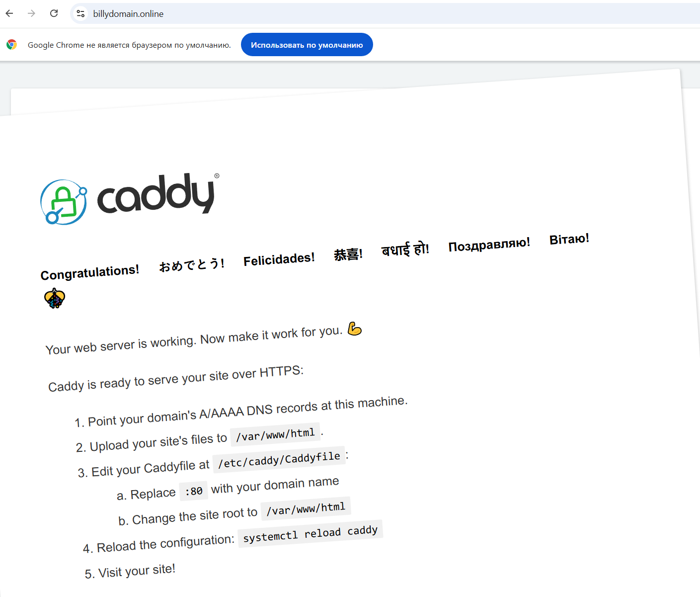

### Задание
1. Создадим плейбук для создания, изменения и удаления тестового файла.  
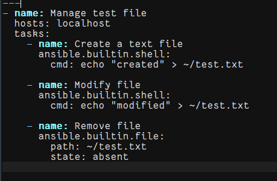

2. Проверим его работу  
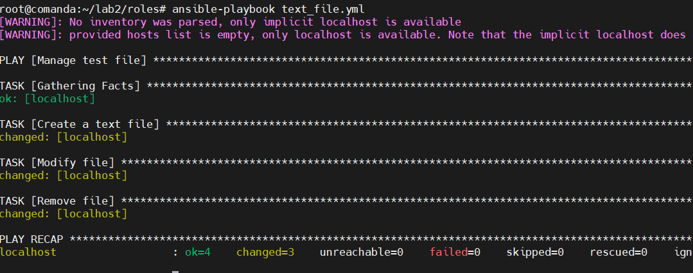

3. Настроим Caddyfile для передачи кастомного хедера и `index.html` файла из нужной нам директории  
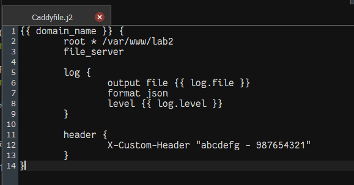
4. Добавим `index.html` в директорию `/var/www/lab2`  
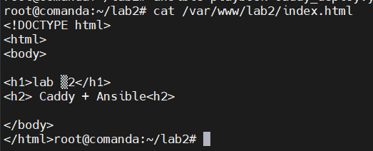
   
5. Проверим отдается ли теперь кастомный хедер  
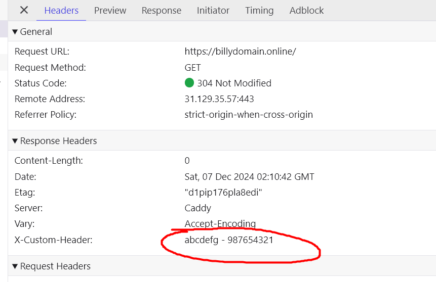

6. Проверим что страница-заглушка Caddy пропала  
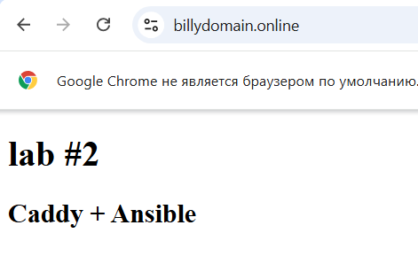
   