# Лабораторная работа 3

## Ход работы

### Часть 1. Поднимаем Postgres

1. Создаем директорию для работы и все нужные файлы, после чего билдим контейнеры   
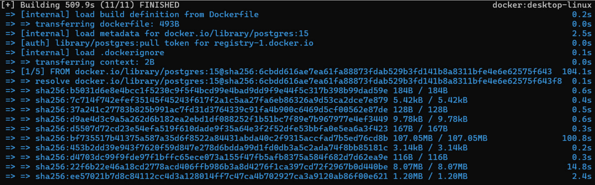

2. Проверяем, что контейнеры были запущены   
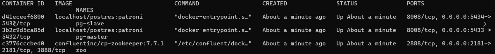

3. Проверяем, что `pg-master` стал лидером, а `pg-slave` — репликой   
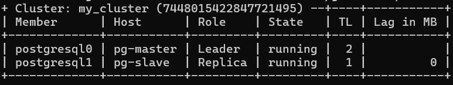

### Часть 2. Проверяем репликацию

1. Подключаемся к базам данных через pgAdmin по localhost и их портам   
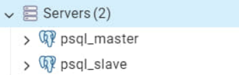

2. Cоздаем таблицу `my_first_replication` с тестовыми столбцами и данными   
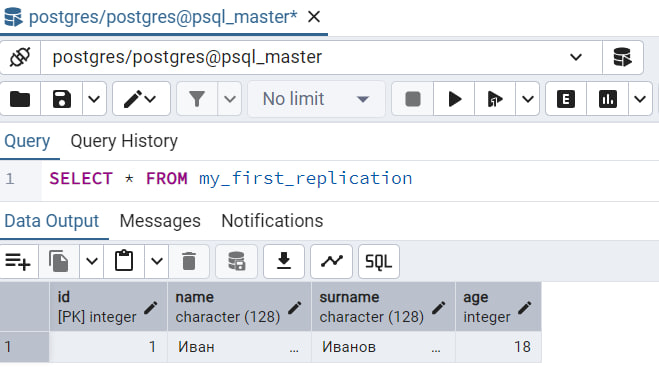

3. Видим, что в `pg-slave` создалась таблица `my_first_replication`, которая содержит такие же данные   
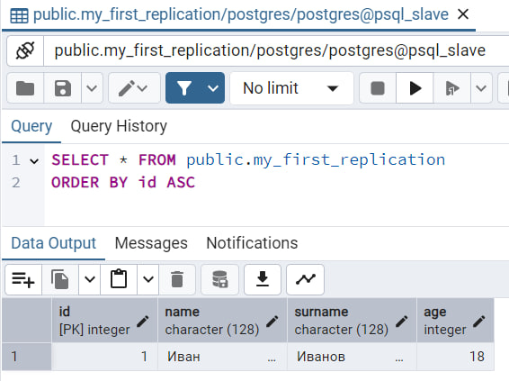

4. Также пробуем что-то изменить в таблице у `pg-slave` и закономерно получаем ошибку, так как данные закрыты для редактирования   
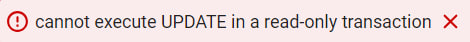

### Часть 3. Делаем высокую доступность

1. Создаем все необходимые файлы по заданию, после чего перезапускаем проект   
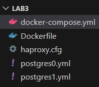

2. Успешно подключаемся к `haproxy`   
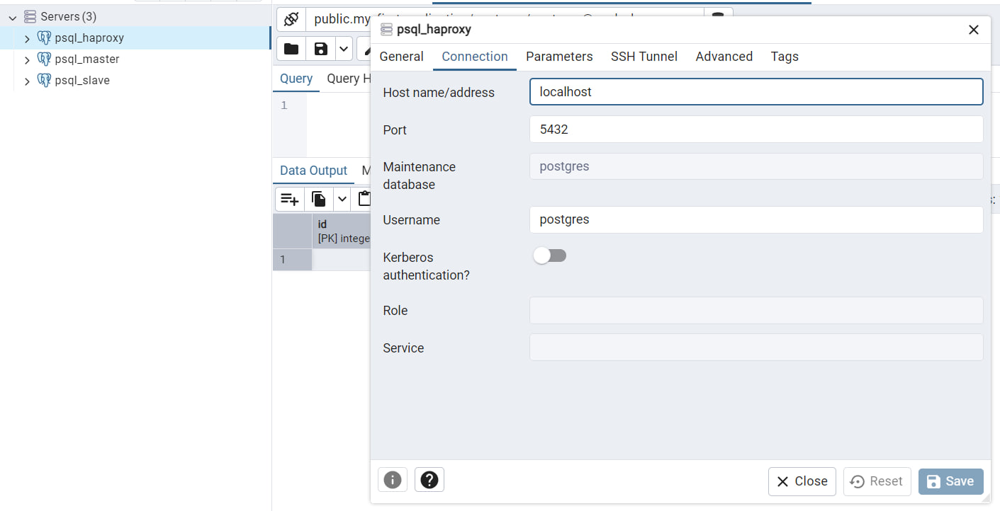

### Часть 4. Задание

1. После остановки `pg-master` с помощью `docker stop pg-master` пробуем изменить данные в `haproxy` (меняем `age`)   
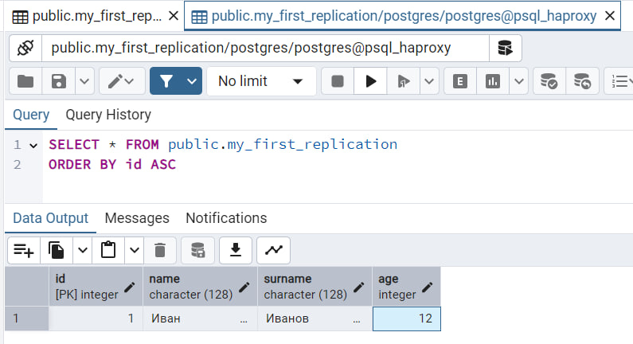

2. В `pg-slave` данные также изменились даже с отключенным `pg-master`   
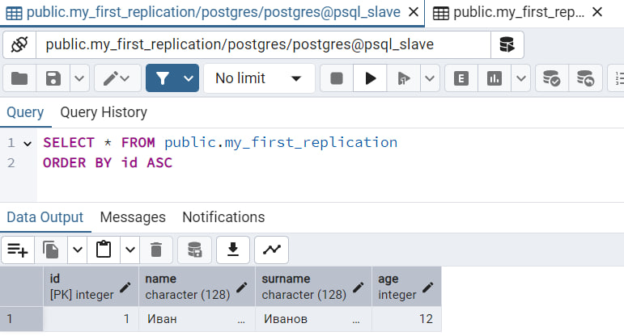

3. Проанализировав логи, увидим, что после отключения `pg-master` с помощью `patroni` перераспредилились роли, и `pg-slave` стал лидером   
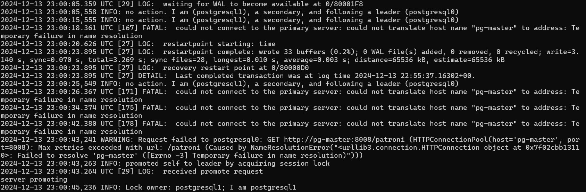

4. Также у `pg-slave` пропало ограничение на запись, что логично, потому что он теперь — лидер (меняем `age`)   
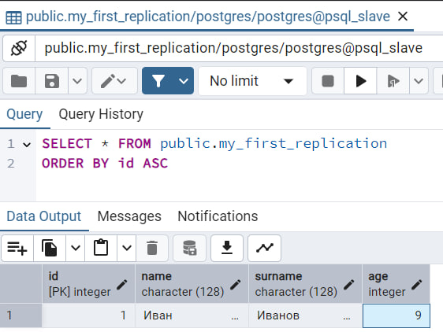

## Ответы на вопросы

##### Порты 8008 и 5432 вынесены в разные директивы, expose и ports. По сути, если записать 8008 в ports, то он тоже станет exposed. В чем разница?
Директива `expose` делает порты доступными только внутри сети `Docker Compose` для взаимодействия между контейнерами, а директива `ports` открывает порты на хост-машине, обеспечивая доступ извне

##### При обычном перезапуске композ-проекта, будет ли сбилден заново образ? А если предварительно отредактировать файлы postgresX.yml? А если содержимое самого Dockerfile? Почему?
В `Docker Compose` образы пересобираются если указать `—build` при запуске.

Если изменить файлы `.yml`, но не пересобирать образы, а запускать командой `up -d`, то ничего не изменится, так как в локальном хранилище останется образ со старыми файлами, и использоваться будет именно он.

Если отредактировать содержимое `Dockerfile`, то образ тоже не будет сбилден, если он уже есть в локальном хранилище.

Для ребилда образа надо указывать всегда  `--build`.
